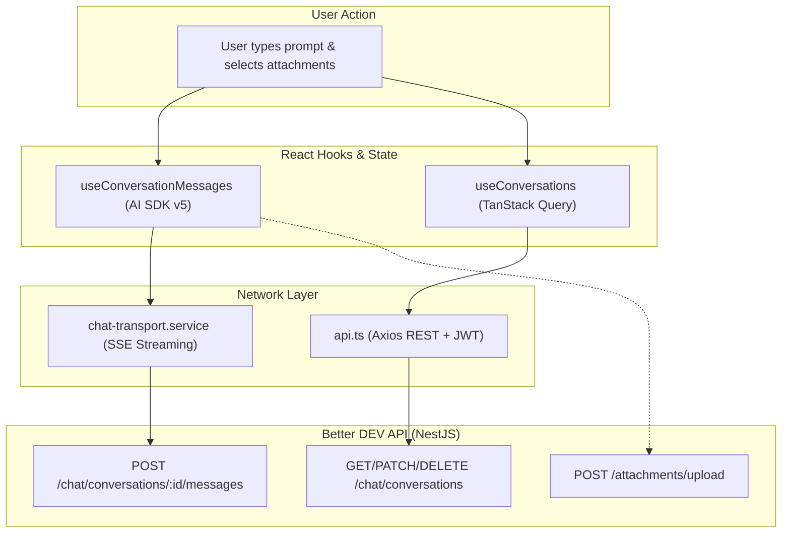

# Better DEV UI

> Modern, real-time multi-modal AI chat interface built with React 19, TypeScript, Tailwind CSS v4, and Vercel AI SDK v5.

[](https://react.dev/)
[](https://www.typescriptlang.org/)
[](https://vitejs.dev/)
[](https://tailwindcss.com/)
[](https://sdk.vercel.ai/)

---

## 📋 Table of Contents

- [Overview](#-overview)
- [Features](#-features)
- [Tech Stack](#-tech-stack)
- [Project Structure](#-project-structure)
- [Architecture & Data Flow](#-architecture--data-flow)
- [Getting Started](#-getting-started)
- [Environment Variables](#-environment-variables)
- [Development & Scripts](#-development--scripts)
- [Deployment](#-deployment)

---

## 🌟 Overview

Better DEV UI is a production-grade, multi-modal chat application designed for low-latency AI conversations. It features streaming text, tool-calling execution visualization, file and image drag-and-drop attachments, operational mode selectors, system prompt customizations, and optimistic UI mutations.

- **Production URL**: [better-dev-ui-kashifrezwis-projects.vercel.app](https://better-dev-ui-kashifrezwis-projects.vercel.app)
- **Backend API**: [better-dev-api (GitHub)](https://github.com/Kashif-Rezwi/better-dev-api) / [API Live Endpoint](https://better-dev-api.onrender.com)

---

## ✨ Features

### 🎨 User Experience & Design
- **Real-Time SSE Streaming**: Token-by-token streaming with smooth markdown rendering and syntax highlighting.
- **Tool Execution Visualization**: Visual status cards for autonomous tool calls (e.g., Tavily web search).
- **Multi-Modal Attachments**: Drag-and-drop support for PDF documents, Word `.docx`, and images with upload progress tracking.
- **Dark Mode UI**: Curated dark interface with custom semantic tokens and smooth animations.
- **Smart Scroll Management**: Intelligent auto-scrolling that pauses when the user scrolls up to review history.

### 💬 Conversational Power
- **Operational Mode Switcher**: Seamlessly switch between **Fast** (low latency), **Thinking** (deep reasoning), and **Auto** (AI classified).
- **System Prompt Customization**: Set custom persona instructions per conversation.
- **Optimistic Mutations**: Instant UI updates on conversation renaming, creation, and deletion with TanStack Query cache rollback on error.
- **Auto Title Generation**: AI auto-generates conversation titles in the background upon first message submission.

---

## 🛠️ Tech Stack

| Layer | Technologies |
| :--- | :--- |
| **Core Framework** | React 19, TypeScript 5.9, Vite 7.1 |
| **Styling & UI** | Tailwind CSS 4.1, Radix UI Primitives, Lucide Icons, Sonner |
| **State & Cache** | TanStack Query v5, React Hook Form, Safe localStorage Wrapper |
| **Streaming & AI** | Vercel AI SDK v5 (`DefaultChatTransport`, `useChat`) |
| **Markdown Rendering** | `react-markdown`, `remark-gfm`, `rehype-highlight` |
| **HTTP Client** | Axios with request/response authentication interceptors |

---

## 📁 Project Structure

```
better-dev-ui/
├── public/                      # Static assets & logos
│   └── dev-logo-light.png
│
├── src/
│   ├── components/              # UI components
│   │   ├── actions-panel/       # Left sidebar (Recents, UserProfile, Navigation)
│   │   ├── activities-panel/    # Right sidebar (System prompt editor)
│   │   ├── chat-area/           # Main chat interface (MessageList, Composer, ModeSelector)
│   │   ├── common/              # Shared components (Markdown, ProtectedRoute, ErrorBoundary, Skeleton)
│   │   └── ui/                  # Radix UI primitives (Button, Dialog, DropdownMenu, Avatar, Card)
│   │
│   ├── constants/               # API endpoints, storage keys, validation rules
│   │
│   ├── hooks/                   # Custom React hooks
│   │   ├── chat/                # useChatAttachments
│   │   ├── conversations/       # React Query hooks for conversation CRUD & cache operations
│   │   ├── ui/                  # usePanelState
│   │   ├── useAuth.ts           # Authentication hooks
│   │   ├── useConversationMessages.ts # AI SDK v5 integration
│   │   ├── useModePreference.ts # Operational mode persistence
│   │   └── useScrollToMessage.ts # Smooth scroll management
│   │
│   ├── pages/                   # Route components (ChatPage, LoginPage, RegisterPage)
│   │
│   ├── services/                # Pure TypeScript API services
│   │   ├── api.ts               # Axios instance & token interceptors
│   │   ├── auth.service.ts      # Auth endpoints
│   │   ├── conversation.service.ts # Conversation CRUD & system prompt APIs
│   │   ├── upload.service.ts    # File upload handling
│   │   ├── chat-transport.service.ts # AI SDK SSE transport
│   │   └── query-client.ts      # TanStack Query client configuration
│   │
│   ├── types/                   # Domain type definitions
│   │   ├── auth.ts
│   │   ├── chat.ts
│   │   ├── conversation.ts
│   │   └── index.ts
│   │
│   ├── utils/                   # Pure utility functions
│   │   ├── cn.ts                # Class merging (clsx + twMerge)
│   │   ├── date.ts              # Relative time formatting
│   │   ├── message.ts           # Message transformations
│   │   ├── storage.ts           # Safe localStorage wrapper
│   │   ├── toast.ts             # Toast helper
│   │   ├── conversationHelpers.ts # Optimistic conversation generators
│   │   └── optimisticUpdates.ts # Query cache update helpers
│   │
│   ├── App.tsx                  # Application route setup with code-splitting
│   ├── main.tsx                 # React root entry point
│   └── index.css                # Tailwind v4 theme & typography
│
├── ARCHITECTURE.md              # Engineering standards & guidelines
├── package.json
├── tsconfig.json
├── vite.config.ts               # Vite configuration with chunk splitting
└── README.md
```

---

## 🏗️ Architecture & Data Flow



---

## ⚙️ Environment Variables

Create a `.env` file in the root directory:

```env
# Vite Client Port
VITE_CLIENT_PORT=3000

# Backend API URL
VITE_API_BASE_URL=http://localhost:3001
# For production:
# VITE_API_BASE_URL=https://better-dev-api.onrender.com
```

---

## 🚀 Getting Started

### 1. Clone & Install
```bash
git clone https://github.com/Kashif-Rezwi/better-dev-ui.git
cd better-dev-ui
npm install
```

### 2. Run Development Server
```bash
npm run dev
```
Open `http://localhost:3000` in your browser.

### 3. Build & Preview Production Bundle
```bash
npm run build
npm run preview
```

---

## 🌐 Deployment

The frontend is deployed to [Vercel](https://vercel.com) with automatic continuous deployment from the `main` branch. All single-page application routes are redirected to `index.html` via `vercel.json`.
